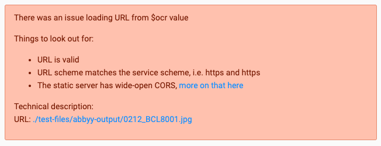

# ls-converter

LabelStudioConverter (or `ls_converter` for short) is a simple library to convert OCR outputs into pre-annotated data for import into [LabelStudio](https://github.com/heartexlabs/label-studio).

Currently, we can convert directly from PyTesseract, ABBYY FineReader, and Transkribus. All that is needed is an `image` (which can be a path, a public URL, or an [Image object](https://github.com/python-pillow/Pillow)) and some `input_data` (which can be a path to a JSON).

It even comes with a quick utility tool to provide the PyTesseract data if you don't have it available:

```py
from ls_converter import LabelStudioConverter, Input
from ls_converter.utils import url_to_tesseract_data

URL = "http://<URL-TO-PUBLICLY-AVAILABLE-IMAGE>"

converter = LabelStudioConverter(input_format=Input.TESSERACT)

converted_data = converter.convert(
    image=URL,
    input_data=url_to_tesseract_data(URL),
)
```

## Installing

Installation of LabelStudioConverter is easily done using PIP:

```sh
$ pip install ls_converter
...
```

## OCR a public image URL with PyTesseract into Label Studio

In this example, we have a publicly available historical newspaper directory [from the University of Leicester‘s Special Collections](https://specialcollections.le.ac.uk/digital/collection/p16445coll4/id/52629/rec/1). We take the direct `URL` to the image and using the built-in `url_to_tesseract_data` function, can pass the image and the data straight into the `.convert` method. The next step is to save the resulting dictionary as a JSON file. There is a helpful `save_json` function built into the package as well. In effectively three lines of code, we have OCR parsed and created a file that we can input into Label Studio.

```py
from ls_converter import LabelStudioConverter, Input
from ls_converter.utils import url_to_tesseract_data, save_json

URL = "http://specialcollections.le.ac.uk/iiif/2/p16445coll4:8897/full/730,/0/default.jpg?page=27"

converter = LabelStudioConverter(input_format=Input.TESSERACT)
converted_data = converter.convert(image=URL, input_data=url_to_tesseract_data(URL))

save_json(converted_data, "import-me-into-label-studio.json")
```

If you select “Optical Character Recognition” in the Labeling Setup of the project where you import the resulting JSON file, you should end up with something like this:


## Using a local image and ABBYY FineReader

If you instead have an image and the resulting JSON file from running it through ABBYY FineReader, you only have to adjust the import of the data thus:

```py
from ls_converter import LabelStudioConverter, Input
from ls_converter.utils import load_json, save_json

LOCAL_IMAGE = "abbyy-output/0212_BCL8001.jpg"
LOCAL_JSON = "abbyy-output/0212_BCL8001.json"
REMOTE_IMAGE = "https://lwmincomingtradedirs.blob.core.windows.net/jpg/0212_BCL8001.jpg"

converter = LabelStudioConverter(input_format=Input.ABBYY)
converted_data = converter.convert(
    image=LOCAL_IMAGE,
    input_data=load_json(LOCAL_JSON),
    url=REMOTE_IMAGE,
)

save_json(converted_data, "import-me-into-label-studio.json")
```

_Note that, in this example, we use the convenient utility function `load_json` to load the JSON file with the ABBYY results. In this example (and any example where you have a locally stored version and a remote version), if you don’t care too much about speed, you can just pass the URL to the `image` parameter. If you are processing 100+ images, the script will run much faster if you have locally stored images._

The result should from the above example, when imported into Label Studio looks differently (since ABBYY’s result will differ from Tesseract’s) but otherwise, the result should be the same look:


### Risk for error

Because you run the data conversion on a local file, you must specify a `url` as a parameter in the `.convert` method (as we did above). Alternatively, after you export the data, you can adjust the `"ocr"` value in the resulting JSON file _before importing it into Label Studio_. Otherwise you will see the following error message:



## Using Transkribus results instead

Out of the box, LabelStudioConverter comes with support for the XML files created by Transkribus, as well. In this example, similar to the ABBYY example above, we provide a local image and a remote version of the same image. and use the `load_xml_as_json` utility function to read in the Transkribus XML as JSON data.

```py
from ls_converter import LabelStudioConverter, Input
from ls_converter.utils import load_xml_as_json, save_json

LOCAL_IMAGE = "transkribus-output/0219_BCL8001.jpg"
LOCAL_XML = "transkribus-output/0219_BCL8001.xml"
REMOTE_IMAGE = "https://lwmincomingtradedirs.blob.core.windows.net/jpg/0219_BCL8001.jpg"

converter = LabelStudioConverter(input_format=Input.TRANSKRIBUS)
converted_data = converter.convert(
    image=LOCAL_IMAGE,
    input_data=load_xml_as_json(LOCAL_XML),
    url=REMOTE_IMAGE,
)

save_json(converted_data, "import-me-into-label-studio.json")
```

The result, since we provide the `url` to the remote image in the example above, is similar (albeit different, due to Transkribus’s OCR and layout parsing algorithm) when viewed in Label Studio:


## Change Log

### 0.0.1 (Dec 14, 2022)

- First alpha version
